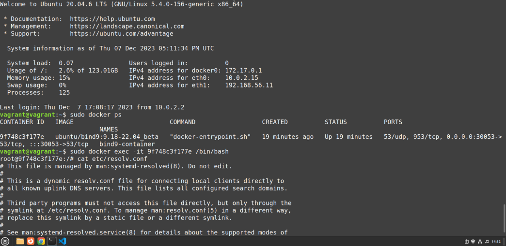

*Documentação - Projeto de Administração de Redes Final*

1. Introdução e Topologia de rede

O projeto consistiu em criar uma rede de computadores com os requisitos de serviços abaixo:

| N | REQUISITOS |
| ------------- | ------------- |
|  RQ01  | Configure um servidor DHCP no ambiente Linux para atribuir endereços IP automaticamente aos dispositivos na rede. |
| RQ02  |Implante um servidor DNS para resolver nomes de domínio dentro da rede e configurar registros DNS como A, CNAME, MX.  |
| RQ03| Configure e hospede um servidor web Apache ou Nginx para fornecer serviços de hospedagem de sites internos.|
| RQ04| Implemente um servidor FTP (por exemplo, vsftpd) para permitir a transferência de arquivos na rede.|
| RQ05| Configure um servidor NFS para compartilhar diretórios e arquivos entre máquinas na rede.|


1.1 Topologia de rede


1.2 Virtualização com o Docker e descrição das Máquinas virtuais

Em cada Máquina Virtual está presente o Docker, que virtualiza o container, responsável por fornecer determinado serviço.


| VM  | Nome da imagem |  Nome e serviço do container | Descrição de serviço|
| ------------- | ------------- |------------- |------------- |
| VM1  | homeall/dhcphelper:latest | dhcp | Automatiza a atribuição de endereços IP e configurações de rede para dispositivos em uma rede |
| VM2  | ubuntu/bind9:9.18-22.04_beta | dns |Associando nomes de domínio a endereços IP correspondentes |
| VM3 | httpd |serverweb4P e apache (servidor web)  |Serviços de hospedagem web |
| VM4 | bogem/ftp |ftp|Transferência de arquivos|
| VM5 |erichough/nfs-server|erichough/nfs-server (mesmo nome)|Compartilhamento de arquivos diretórios em uma infraestrutura de rede|


   
2. Execução e configuração dos container

Requisitos

| Nome  | Versão |
| ------------- | ------------- |
| Sistema Operacional  | Linux Mint 21.2 |
| Intereface de virtualização  | Vagrant 2.2.19  |
| Provedor  |  VirtualBox Versão 6.1.38 para Ubuntu |
| Fornecimento de serviços para as VM's  |  Docker 24.0.5 |

Comandos básicos

| Ordem | Comandos | Descrição|
| ------------- | ------------- | ------------- |
| 1    | apt update e sudo apt -y install vagrant     | Instalação do vagrant |
| 2   | apt update e sudo apt -y docker.io     | Instalação do Docker |
| 3    |  sudo apt install  virtualbox-qt   | Instalação do Virtual Box |
| 4    | vagrant up      | Geração da rede de computadores com Vagrantfile |
| 5    | docker run     | Fornecimento dos serviços solicitados por meio da conteinerização|

Com o vagrant up, as vm's serão criadas e teremos acesso à rede de computadores.
Já com o docker run, é possível criar container a partir da imagem do serviço solicitado.
A execução da rede de computadores e o oferecimento dos serviços solicitados.


2.1 Configuração do servidor DHCP

Observação: exemplo base, adaptado durante a execução

Arquivo responsavel por determinar a configuração dos IP's automaticamente para dispositivos de redes. Definir a lógica de atribuição, minutagem
e outras relacionadas à configuração DHCP.

```
ddns-update-style none;
default-lease-time 600;
max-lease-time 7200;
authoritative;
subnet 192.168.1.0 netmask 255.255.255.0
{
   range 192.168.1.100 192.168.1.200;
   option routers 192.168.1.2;
   option domain-name "minhaempresa";
   option domain-name-servers 192.168.1.2;
   option broadcast-address 192.168.1.255;
}
```

Esse arquivo foi colocado no host e compartilhado com a VM1. Após esse compartilhamento vai ser possível enviar para o container e configurar o serviço dhcp de acordo com
 
 2.1.1
 
 default-lease-time e max-lease-tim e -> controle de tempo das concessões;

 2.1.2

 subnet e netmask -> define IP e mascara


3. Testes e resultados

   3.1 Teste das VM's

| Ordem | VM | Descrição|
| ------------- | ------------- | ------------- |
| 1   | Todas as VM's  | Teste da instalação do docker, com intuito de checar a possibilidade de fornecer os serviços por meio do container. Isso pode ser feito por meio de acesso às VM's, com o camando vagrant ssh nome_vm|
| 2     | Todas as VM's | Uso do docker ps para checagem de execução dos container, após acessar com o docker exec, a fim de testar posteriormente os serviços.|
| 3     | VM1  | Teste de funcionamento do "dhcp.config", responsável pelo endereço de rede fornecido pelo serviço.|
| 4     | VM3  | Teste de funcionamento para verificar a versão instalada de seu servidor web Apache "apache2 -V" que mostra todos os dados do servidor Apache, como a versão, a data de criação e dados em geral.|
| 5     | VM4  | Para testar o protocolo de rede para a transmissão de arquivos entre computadores (FTP), usamos apenas o "status" para mostrar o status atual da conexão.|
| 6     | VM5  | Teste de verificação para mostrar que o NFS apareça que está em execução "showmount -e hostname"|
| 7     | Todas as VM's   | Testar e entrar container com docker exec|

   3.2 Testes e resultados da VM

- Testes na VM1

A VM1 é responsável por oferecer a implantação do Docker, que realiza a conteinerização do serviço dhcp. Esse serviço pode ser testado acesssando o container e checando o envio da configuração para o serviço, que atribui endereços IP automaticamente aos dispositivos na rede.

  

 - Testes na VM2

A VM2 virtualiza o serviço de DNS por meio do Docker. Isso pode ser realizado  ao acessar o container e testando a atribuição de nomes a endereços de IP.

  

  
- Testes na VM3

O container presente na VM3 é responsável por realizar a hospedagem web de sites e arquivos, por meio do apache. Os testes realizados a seguir buscou testar o funcionamento do serviço, acessando o container e encontrando a pasta com os arquivos compartilhados do host, que hospeda no container o site


- Testes na VM4

Essa VM realiza a criação de container para oferecer o serviço de FTP, que permitir a transferência de arquivos na rede. Acessando os arquivos de confi e etc.


